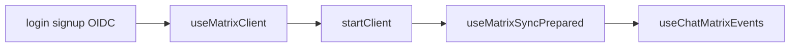
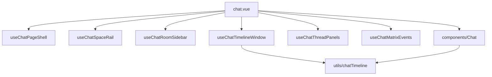
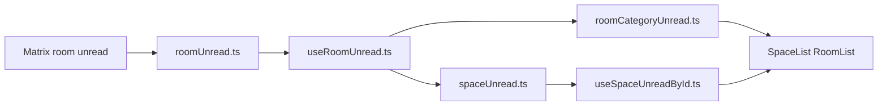

# Decentra architecture map

Concise guide to the Nuxt 4 Matrix client. Paths are relative to the repo
root. For bundle sizes see [build-bundling.md](build-bundling.md).

## Repo layout

| Path | Role |
| --- | --- |
| `app/` | Nuxt app: pages, components, composables, utils, middleware |
| `app/pages/` | Routes (`chat.vue`, `settings/*`, auth, `rooms/new`, `spaces/new`) |
| `app/components/` | Vue UI (`Chat/`, `settings/`, signup steps) |
| `app/composables/` | Shared logic (`matrix/`, `chat/`, `i18n/`, hooks) |
| `app/utils/` | Pure helpers (timeline, unread, permissions, notify) |
| `app/middleware/` | `auth.global.ts` — session gate for chat/settings |
| `tests/unit/` | Vitest unit tests (mirrors `app/` structure) |
| `tests/integration/` | Vitest integration (Matrix client, timeline, i18n) |
| `tests/e2e/` | Cucumber features + Playwright step definitions |
| `.cursor/rules/` | CCD, git, GitHub solo workflow, Cucumber conventions |
| `scripts/` | Line-limit check, chunk size reporter |
| `.github/workflows/` | CI (`ci.yml`) |

After issue #63 splits, large entry files stay as **orchestrators**;
logic lives in subfolders (see below).

---

## Matrix client layer

### Entry: `useMatrixClient`

[`app/composables/useMatrixClient.ts`](../app/composables/useMatrixClient.ts)
is the **facade**: session `useState`, login/logout, `startClient`, and
re-exports from `app/composables/matrix/*`.

[`app/app.vue`](../app/app.vue) uses it globally for session restore overlay.

### Submodule `app/composables/matrix/`

| File | Responsibility |
| --- | --- |
| `matrixClientShared.ts` | Homeserver URL, error codes, user-id helpers |
| `matrixClientHelpers.ts` | `matrix.to` links, normalisation |
| `matrixClientTypes.ts` | Room/message/session types |
| `sessionCrypto.ts` | localStorage session/device, Rust crypto WASM, verification |
| `recoveryKeyBootstrap.ts` | Recovery key → cross-signing bootstrap |
| `messages.ts` | Send, edit, reactions, media messages |
| `roomsOrDirectory.ts` | Rooms, spaces, directory, DMs, invites |
| `mediaUpload.ts` | Upload helpers |
| `matrixRegistrationUia.ts` | Legacy `/register` UIA loop |
| `signupUiaCore.ts`, `signupUiaFlows.ts` | UIA flow selection |
| `matrixOidcNative.ts` | Delegated OIDC (MAS) |
| `spaceStateHelpers.ts`, `spaceRolesStateHelpers.ts`, `spaceRolesRoomSync.ts` | Space roles / state (not Matrix sync state) |

### Sync and crypto touchpoints

| Concern | Where |
| --- | --- |
| Start sync | `useMatrixClient` — `restoredClient.startClient({ initialSyncLimit: 50 })` |
| Initial sync gate | [`useMatrixSyncPrepared.ts`](../app/composables/useMatrixSyncPrepared.ts) — `SyncState.Prepared`, `isInitialSyncComplete` |
| Room/timeline listeners | [`useChatMatrixEvents.ts`](../app/composables/chat/useChatMatrixEvents.ts) |
| Crypto init | `matrix/sessionCrypto.ts` — WASM, stored session |
| Cross-signing | `matrix/recoveryKeyBootstrap.ts` |

Unread UI should wait for initial sync (`useMatrixSyncPrepared`) before
trusting aggregated counts.

Signup / OIDC product detail: [README.md](../README.md) — Matrix registration.

---

## Chat UI stack

### Page orchestrator

[`app/pages/chat.vue`](../app/pages/chat.vue) wires composables, passes
props to `components/Chat/*`, and handles document title / notify hooks.

### Composables `app/composables/chat/`

| Composable | Role |
| --- | --- |
| `useChatPageShell.ts` | Route, mobile layout, space hierarchy refresh |
| `useChatSpaceRail.ts` | Left space rail (Home + spaces), rail unread |
| `useChatRoomSidebar.ts` | Categories/rooms per space, DnD, permissions |
| `useChatTimelineWindow.ts` | Message window load / pagination |
| `useChatThreadPanels.ts` | Threads, thread read state |
| `useChatMatrixEvents.ts` | Matrix event watchers for active room |
| `chatPageRoomHelpers.ts` | Room names, types, member sort |
| `chatPageTypes.ts` | `RoomItem`, `SpaceItem`, breakpoints |

Related outside `chat/`: `useChatMedia.ts`, `useRoomTyping.ts`,
`useComposerMediaUpload.ts`, `useVoiceRecorder.ts`, `useEmojiPickerData.ts`.

### Components `app/components/Chat/`

| Component | Role |
| --- | --- |
| `SpaceList.vue` | Space rail |
| `RoomList.vue`, `RoomCategoryList.vue` | Sidebar rooms / categories |
| `MessageList.vue`, `MessageItem.vue` | Timeline |
| `MessageInput.vue` | Composer |
| `ChatRoomHeaderToolbar.vue`, `MemberList.vue` | Room chrome |
| `ChatThreadPanel.vue`, `ChatRoomThreadListPanel.vue` | Threads |
| `ChatPinnedMessagesPanel.vue` | Pinned messages |
| `VoiceMessagePlayer.vue`, `VideoMessagePlayer.vue` | Media playback |
| `Onboarding/*` | DM start, public rooms, onboarding panel |

### Timeline utils

[`app/utils/chatTimeline.ts`](../app/utils/chatTimeline.ts) re-exports
[`app/utils/chatTimeline/`](../app/utils/chatTimeline/) (`mapping.ts`,
`relations.ts`, `reactionsAndMedia.ts`, `threadNav.ts`, `types.ts`).

Permissions: `matrixRoomMessagePermissions.ts`,
`matrixRoomChannelPermissions.ts`. Typing: `composerTypingNotifier.ts`,
`typingIndicator.ts`.

---

## Unread and notifications pipeline

Data flows **room counts → category/space aggregation → UI** (and optional
browser notify).

| Layer | Files |
| --- | --- |
| Build counts from SDK | [`app/utils/roomUnread.ts`](../app/utils/roomUnread.ts) — `buildUnreadByRoomId` |
| Reactive per-room | [`app/composables/useRoomUnread.ts`](../app/composables/useRoomUnread.ts) — debounced refresh, `markRoomAsRead` |
| Category badges | [`app/utils/roomCategoryUnread.ts`](../app/utils/roomCategoryUnread.ts) |
| Space rail | [`app/utils/spaceUnread.ts`](../app/utils/spaceUnread.ts), [`useSpaceUnreadById.ts`](../app/composables/useSpaceUnreadById.ts) |
| Push rules UI | [`matrixNotificationRules.ts`](../app/utils/matrixNotificationRules.ts), [`useNotificationSettings.ts`](../app/composables/useNotificationSettings.ts) |
| Sound / incoming | [`incomingMessageNotify.ts`](../app/utils/incomingMessageNotify.ts), [`messageNotifySound.ts`](../app/utils/messageNotifySound.ts), [`useMessageNotifyPreference.ts`](../app/composables/useMessageNotifyPreference.ts) |
| Tab title | [`documentTitle.ts`](../app/utils/documentTitle.ts) — used from `chat.vue` |
| Sync gate | `useMatrixSyncPrepared` — avoid stale badges before first sync |

**Space unread aggregation** starts in `spaceUnread.ts` and
`useSpaceUnreadById.ts` (composable maps space id → counts for the rail).

E2E: `tests/e2e/features/chat.feature`, `step-definitions/unread-channel.steps.mjs`.

---

## Spaces, categories, and sidebar

| Concern | Files |
| --- | --- |
| Category / room hierarchy | `app/utils/spaceRoomCategories.ts`, `homeRoomCategories.ts` |
| Space rail | `useChatSpaceRail.ts` → `SpaceList.vue` |
| Room sidebar | `useChatRoomSidebar.ts` → `RoomList.vue`, `RoomCategoryList.vue` |
| Space roles | `decentraSpaceRoles.ts`, `decentraSpaceRolesPermissions.ts`, `spaceRolesMatrixSync.ts` |
| Settings composables | `useSpaceRoles.ts`, `useSpaceSettings.ts`, `useSpaceMembers.ts` |
| New space page | [`app/pages/spaces/new.vue`](../app/pages/spaces/new.vue) |

`HOME_SPACE_ID` in `spaceUnread.ts` — conceptual “Home” entry on the rail.

---

## Settings vs chat

| Route | Page | Focus |
| --- | --- | --- |
| `/chat` | `app/pages/chat.vue` | Main chat UI |
| `/settings/account` | `app/pages/settings/account.vue` | Account, theme, locale, notify, verification |
| `/settings/space/[spaceId]` | `app/pages/settings/space/[spaceId].vue` | Space settings |
| `/settings/room/[roomId]` | `app/pages/settings/room/[roomId].vue` | Room settings |

Auth routes (not settings): `login.vue`, `signup.vue`,
`signup/verify-email.vue`, `auth/matrix-oidc/callback.vue`, `index.vue`.

Creation: `rooms/new.vue`, `spaces/new.vue`.

[`app/middleware/auth.global.ts`](../app/middleware/auth.global.ts) protects
`/chat`, `/settings`, `/spaces/new`, `/rooms` — restores session via
`useMatrixClient()`.

Settings components: `app/components/settings/` (e.g.
`AccountVerificationPanel.vue`, `SpacePermissionRoleSelect.vue`).

---

## Test layout

| Layer | Path | Command |
| --- | --- | --- |
| Unit | `tests/unit/` — mirrors `composables/`, `utils/`, `components/Chat/`, `pages/` | `npm run test:unit` |
| Integration | `tests/integration/` — `useMatrixClient`, `chatTimeline`, i18n | `npm run test:integration` |
| E2E | `tests/e2e/features/*.feature`, `step-definitions/`, `support/` | `npm run test:e2e` |

Matrix client unit tests are split:
`useMatrixClient.session.spec.ts`, `.messages.spec.ts`, `.rooms.spec.ts`,
`.signup.spec.ts`, `.helpers.spec.ts`, `matrixClientShared.spec.ts`.

Setup: `tests/setup.ts`. E2E credentials: `tests/e2e/.env.e2e.local` (see
README).

---

## Where to change X

| Task | Start here |
| --- | --- |
| Matrix send / edit / reactions | `app/composables/matrix/messages.ts`; exports in `useMatrixClient.ts` |
| New message type / timeline UI | `app/utils/chatTimeline/*`, `MessageItem.vue` |
| New room or space action | `matrix/roomsOrDirectory.ts`, `useChatRoomSidebar.ts` |
| Unread or space-rail badge | `roomUnread.ts`, `spaceUnread.ts`, `useSpaceUnreadById.ts` |
| Push / sound / browser tab title | `incomingMessageNotify.ts`, `documentTitle.ts`, wiring in `chat.vue` |
| i18n string | `app/composables/i18n/locales/en.ts` and `de.ts` |
| E2E scenario | `tests/e2e/features/*.feature` + matching `step-definitions/` |
| Bundle / chunk size | [build-bundling.md](build-bundling.md) |
| Auth / session restore | `useMatrixClient.ts`, `sessionCrypto.ts`, `auth.global.ts` |
| Space permissions / roles | `decentraSpaceRoles*.ts`, `useSpaceSettings.ts`, settings space page |
| Line limit / file split | `.cursor/rules/clean-code-developer.mdc`, `npm run check:line-limit` |

---

## Keeping this doc current

Patch only the section that changed. Add a cheat-sheet row when a new
subsystem gets a stable “start here” path. See
[issue-documentation-checklist.md](issue-documentation-checklist.md).
